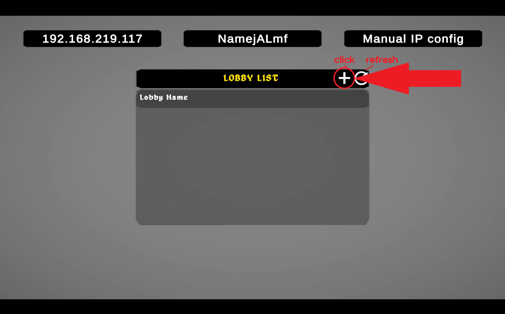
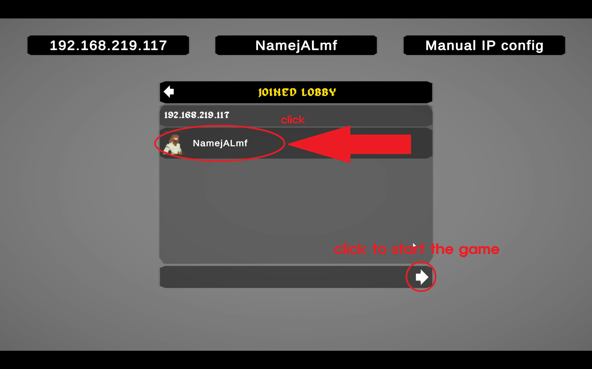

# Souls
A simple turn based card auto battler                      
Motivated by Inuyasha demon tournament (이누야샤 데몬 토너먼트)             

    
## rule
1. Select three scrolls in order of action you want 
2. Click confirm and wait for opponent to choose
3. After both players confirmed their scrolls, scroll activation phase begins
4. Repeat 1~3 until one of the player is down
                 
In step 1, you can click 'auto select' button to choose card that the system suggests          
If you don't want it, click 'reset cards' button and click to choose the order of scrolls again            

## Installations
Windows:         
Download 'Souls_PC_20251022.zip' file and unzip it          
Execute the 'Souls.exe' file            

Android:
Go to Phone Settings > Security > Disable Automatic Security Risk Blocking             
Security > Other Security Settings > Install apps from unknown sources > Allow "My Files"              
Download 'Souls_Android_20251022.zip' file and unzip it   
Then, click the .apk file (with the Unity logo) and select "Install anyway."

[한국어]
휴대폰 설정 > 보안 > 보안위험자동차단 끄기               
보안 > 기타보안설정 > 출처를 알수없는 앱설치 > '내 파일' 을 허용시키기                         

그 뒤, 다운받아진 .apk 파일(유니티 로고 그려짐)을 클릭하고 '보안 무시하고 설치'                    

## Sample run

- Youtube tutorial link

English                  
https://www.youtube.com/watch?v=gS2r5W1lAa0
                  
Korean
https://youtu.be/oHW0zudMw8k

- How to create Lobby
1. click 'local multiplayer'
2. click '+' icon on top right corner
3. click 'create' button on bottom right corner

  

  

- How to join Lobby
1. click 'refresh' button on top right if lobby does not appear (both players should be in same LAN/wifi)
2. click the lobby you want to join
3. After a host clicks start, press the arrow on the bottom right corner 
                

  

- Scroll Selection phase          
  

- After Selecting the Scrolls         

- Scroll activation Phase    
  
  

                           
- Character Selection           
  
  
  
  
  

  
## version history
2025.10.04 ~ 2025.10.20 First draft                        
2025.10.21 ~ 2025.10.24 Minor bug fix & user friendly optimization

## License

